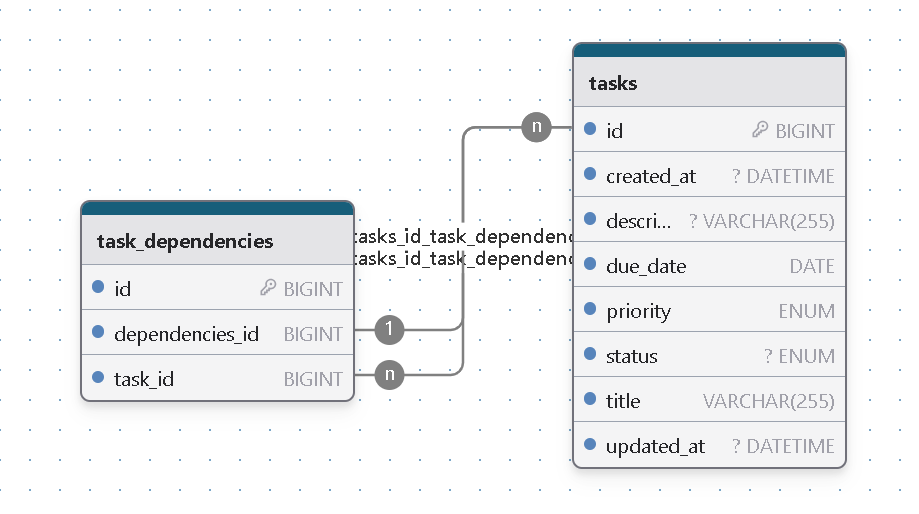

# REST API cho Ứng dụng Danh sách Việc Cần Làm

Xây dựng Backend API cho ứng dụng danh sách việc cần làm bằng Spring Boot, MySQL, Redis, Docker.

## Cơ sở dữ liệu

## Hướng dẫn Thiết lập

### Điều kiện Tiên quyết

* Java 21 trở lên
* Maven hoặc Gradle
* Docker
* MySQL Database
* Redis

### Thiết lập Cơ sở Dữ liệu

1.  Đảm bảo bạn đã cài đặt và chạy MySQL trên máy tính hoặc sử dụng Docker.
    ```properties
    version: '3.8'
        services:
            mysql:
                image: mysql:latest
                container_name: mysql-todo-app
                environment:
                    MYSQL_ROOT_PASSWORD: password
                    MYSQL_DATABASE: todolist
                ports:
                - "3306:3306"
              volumes:
                - mysql_data:/var/lib/mysql
    ```
2.  Tạo cơ sở dữ liệu có tên `todolist` (hoặc theo cấu hình trong `application.properties`).
3.  Ứng dụng được cấu hình để tự động tạo bảng khi khởi động (sử dụng cấu hình `spring.jpa.hibernate.ddl-auto: update`).

### Chạy Ứng dụng (Không có Docker)

1.  Clone repository này.
2.  Di chuyển đến thư mục dự án trong terminal.
3.  Cấu hình kết nối cơ sở dữ liệu trong `src/main/resources/application.properties`:
    ```properties
    spring.datasource.url=jdbc:mysql://localhost:3306/todolist
    spring.datasource.username=your_mysql_username
    spring.datasource.password=your_mysql_password
    spring.jpa.hibernate.ddl-auto=update
    ```
    *(Điều chỉnh thông tin đăng nhập cơ sở dữ liệu nếu cần)*
4.  *(Tùy chọn) Nếu sử dụng Redis caching, cấu hình kết nối Redis trong `application.properties` hoặc `RedisConfig.java`.*
5.  Chạy ứng dụng bằng Maven: `mvn spring-boot:run` hoặc Gradle: `gradle bootRun`.
6.  API sẽ có thể truy cập tại `http://localhost:8080/api/tasks`.

### Chạy Ứng dụng bằng Docker Compose

1.  Đảm bảo Docker và Docker Compose đã được cài đặt.
2.  Clone repository này.
3.  Di chuyển đến thư mục dự án trong terminal.
4.  Build và chạy ứng dụng bằng Docker Compose: `docker-compose up --build`.
5.  API sẽ có thể truy cập tại `http://localhost:8080/api/tasks`. Cơ sở dữ liệu MySQL và Redis (nếu được kích hoạt) cũng sẽ được khởi động trong các container Docker.

### Các Điểm Cuối API (API Endpoints)

**Tasks:**

* `POST /api/tasks`: Tạo một task mới (`Request body`: `TaskDto` ở định dạng `JSON`).
* `GET /api/tasks/{id}`: Lấy thông tin task theo ID.
* `GET /api/tasks`: Liệt kê tất cả các task với phân trang và lọc tùy chọn (`query parameters`: `page`, `size`, `title`, `status`, `priority`, `dueDateFrom`, `dueDateTo`).
* `PUT /api/tasks/{id}`: Cập nhật chi tiết và trạng thái task (`Request body`: `TaskDto` ở định dạng `JSON`).
* `DELETE /api/tasks/{id}`: Xóa task.

**Task Dependencies:**

* `POST /api/tasks/{taskId}/dependencies/{dependencyTaskId}`: Thêm một dependency.
* `DELETE /api/tasks/{taskId}/dependencies/{dependencyTaskId}`: Xóa một dependency.
* `GET /api/tasks/{taskId}/dependencies/all`: Lấy tất cả các dependency (trực tiếp và gián tiếp).

* **Notification:**

* `POST /api/notifications/trigger-task-check`: Kiểm tra các task sắp đến hạn và quá hạn.
